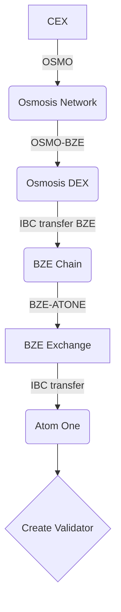
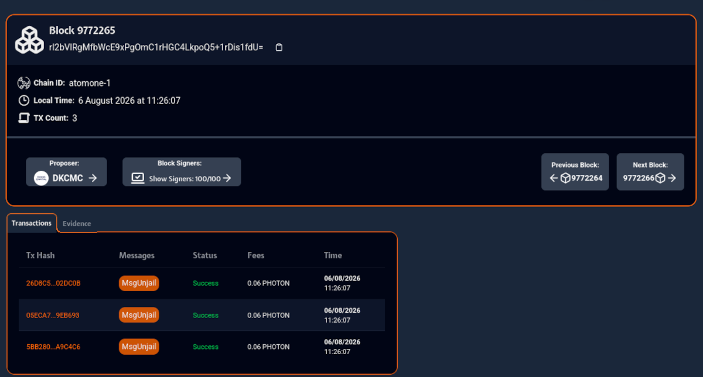
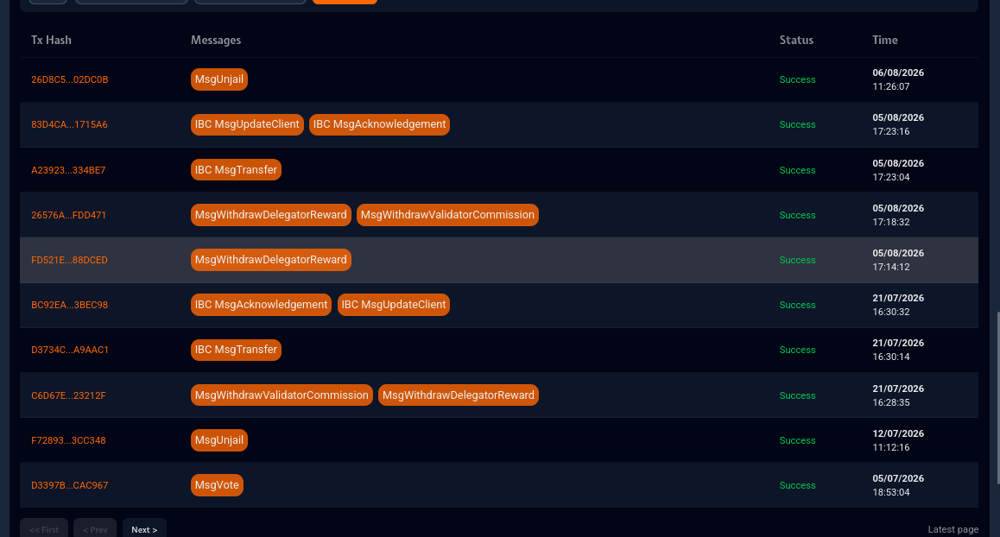
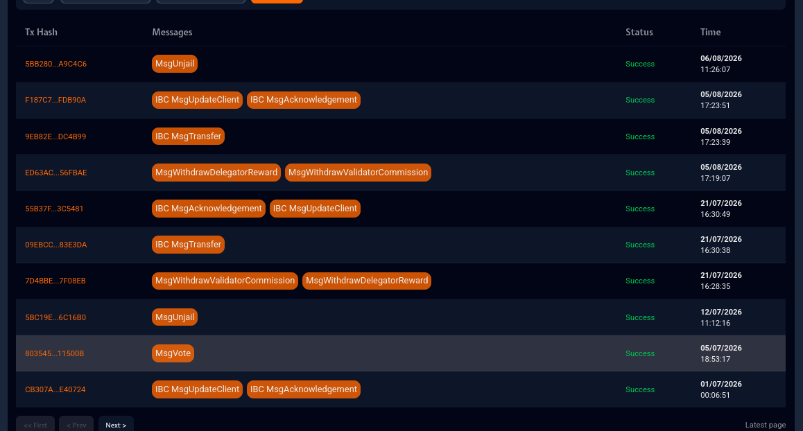
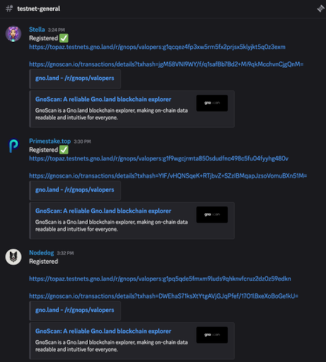

# Atom One Sybil Validator Report

## Table of Contents

- [Intro](#intro)
- [Details of the Investigation](#details-of-the-investigation)
  - [Created the validators at the similar times](#created-the-validators-at-the-similar-times)
  - [Unjailing at almost same block height](#unjailing-at-almost-same-block-height)
  - [Transfers of the assets between each other](#transfers-of-the-assets-between-each-other)
  - [Some of the transactions have near-identical timestamps](#some-of-the-transactions-have-near-identical-timestamps)
- [Conclusion](#conclusion)
- [Comments from Cogwheel to other validators and delegator](#comments-from-cogwheel-to-other-validators-and-delegator)

## Intro

The purpose of this report is to expose and share the data about sybil
validators on the Atom One network. These validators were probably operated by
the same person or group and they split the operation into 3 entities:

- Sybil validators:
  - Stella 💜🐾
  - PrimeStake 🌍🛡️
  - 🐶 Nodedog 🐶

Probable reason for this is to acquire more delegations from the All in Bits
(AiB), which they just sold and moved to a Centralized Exchange (CEX). Besides
this operation there was a similar operation which involved another group,
Nurturra and Shire validators. However this report will only focus on the 
first operation.

The involved parties that helped with the investigation were:

- AkatSuki ( noticed the unusual behaviour )
- Cogwheel ⚙️ ( tracked the transactions, collected the info )
- Tanjira ( also tracked the transactions )
- Ruangnode ( informed the Gnoland team )
- All in Bits ( confirmed the suspicions and redelegated assets from sybil validators )

## Details of the Investigation

On July 23rd, 2026 validator under moniker AkatSuki suggested that some validators might be operated by
the same person or a group.

This was confirmed through some actions this group took on the network:

1. Created the validators at the similar times.
2. Unjailing the validators at the same exact block height.
3. Transfer of the assets between each other.
4. Some other transactions like IBC message transfer and selling ATONE were mirrored and executed similar times.

### Created the validators at the similar times

All three validators were created at the similar times:

- Stella 1st February 2025
- Primestake 29th January 2025
- Nodedog 28th January 2025

Each and every one bought OSMO on the CEX, which was later swapped for the BZE and sent to the BZE chain.
Then they would acquire ATONE and move it to the Atom One where they would create the validators.
Each address at this point is unique and there is no way to tie them together. Accessing the CEX records was
not possible. But it provides a link to each other, with other evidence.

### Unjailing at almost same block height

All of the 3 validators were jailed at similar times and usually unjailed at the same times:

- [Height 9772265](https://thespectra.io/atomone/blocks/9772265)
- [Height 9401316](https://thespectra.io/atomone/blocks/9401316)
- [Height 7804246](https://thespectra.io/atomone/blocks/7804246)
- [Height 7112866](https://thespectra.io/atomone/blocks/7112866)

There are some more events like this or there are some minor differences in the unjailing times. This
definitely points to that there is a common operator behind these validators which was needed to be
disclosed in the AiB delegation form under _Disclosure of Conflict of Interest_.

### Transfers of the assets between each other

Some of these addresses are connected, they sent the assets between them selves in some instances:

Transactions collected by Tanjira Validator:

- [Nodedog -> Primestake 38.682927 ATONE](https://www.mintscan.io/atomone/tx/5DAF66548B935F9970C1395383BB9442F2483E1AF73797D84B7B5851FFFA6707)
- [Stella -> Primestake 28.583769 ATONE](https://www.mintscan.io/atomone/tx/2A32EDC7935E2F31259DD196D094CFD564761E33646C64BAE60F1E5506F8309B)

These 2 transaction were executed with 11 seconds apart. Later these were then transferred [via IBC to Osmosis](https://thespectra.io/atomone/transactions/9394509D0CCD14623EF8DBB538B35434427B516985B93F65700AB9EADE6CD03D)
then it was [swapped to ATOM](https://www.mintscan.io/osmosis/tx/4A07A6FB4EC9D2B58368625A7550FE33BAD2ADB8D81B114616549CD140E1EDB2?height=57029595), and moved [via IBC to Cosmos Hub](https://www.mintscan.io/osmosis/tx/58641585E5CA2236D551004DFD9549461F3BD88D62D94ADD9D0C3BE89D7A556F?height=57029598). From here it is moved to a CEX and makes it harder to track to.

There are also 2 transactions that connect Primestake and Stella :

- [0.2 PHOTON](https://thespectra.io/atomone/transactions/2331FD5F90E6BF22B649570DBC6A965060BBA2F6203C7139B77AF54252482871)
- [0.5 PHOTON](https://thespectra.io/atomone/transactions/94FA1DFDB36A91C20EF9E4E733A9568A6E72A61F48B1DDBE0D450715B6C0D76C)

They are meaningless in terms of amount but it still connects them together. Reason behind these transfer is
unknown but it just proves their.

### Some of the transactions have near-identical timestamps

As seen with some above some of these transactions are so close in time that they have the same timestamp.
Which suggest some heavy scripting to withdraw assets and move them to the CEX to probably simplify
management of these assets. Could also be just some good organization too but it is so strange.
Just for the sake of the argument go to Nodedog's address [atone1s730pkrq2hxh762thw3als22st5p8jt2xjk8mj](https://thespectra.io/atomone/account/atone1s730pkrq2hxh762thw3als22st5p8jt2xjk8mj) and Stella's address [atone1rs3vdtdwq8mnnr92zsgugrrs0zue0ejn52ww02](https://thespectra.io/atomone/account/atone1rs3vdtdwq8mnnr92zsgugrrs0zue0ejn52ww02). There are also images below so you can understand it better:

Now you might think this is from the same address but this isn't the case. Their timestamps are so close it
looks like they are from the same address but they are not. And if you visit their address pages you can see
how much is "mirrored".

## Conclusion

They operated like this for a year and a half. And they also integrated into the Gnoland testnet as the
active validators. They probably thought they could expand their operations to other chains.

*Screenshot by NyanCat Validator*

The Ruangnode Validator as one of the Ambassadors on the Gnoland shared information with their team, which
resulted them being removed from the testnet.

On the 10th August 2026 AiB removed the delegation from these sybil validators, more details can be found
[here](https://github.com/allinbits/AiB-ATONE-Delegation-Program/blob/main/Cycle-II-Correction.md).

Bad news it they were active for this long time and there were no contribution
what so ever from them. They just went in and sold all of the assets.

Good news is that they only had about 300K ATONE delegations from the AiB delegation program, so they never
had a lot of exposure or influence on the network. And any further progress to expand to Gnoland has been
halted.

The real question is did they affect other networks in a similar way, just by using another monikers?
Out of 100 validators on the Atom One network, 5 were sybil validators operated by 2 groups.

## Comments from Cogwheel to other validators and delegator

While this seems like an isolated case, I believe it's important to acknowledge that sybil validators can
affect the network in a similar way to other malicious actors. These assets could have been allocated to the
validator that really contribute to the network. While on Atom One governance limit the validator voting
power to what the address has staked, on some other networks they could have gained governance power and
maybe even manipulate the network's governance decisions.

Any validator that notices this behavior on any network should report and expose them publicly. While it
might not seem as harmful as it first appears, it's important to note that it can have serious consequences
for the network's security and governance. Regular delegators might not have the knowledge or resources
to detect these events, so it falls to us to take action and protect the network.

Delegators while sometimes might not be aware of all of the actions taken by validator, you must be aware of
the potential consequences and take appropriate action to protect the network. From your side you can
research the validator and look into how they contribute to the network, and delegate to them if they are a
good fit for the network.

Here is a quick check list of what you can do and what to expect:

1. Does this validator have a website, or at least some public social media account? If a validator doesn't have someone on the team with basic programming knowledge, at least they should have a simple Wordpress website or even use AI to create some simple website with at least one page, it might be a sign of a more serious issue.
2. Does this validator have some app or service that they provide for the network? Is there anything that makes them unique or valuable to the network? Some checklist of useful things to look for:
   1. Infrastructure (REST APIs, RPCs, Archive Nodes, Network snapshots etc...)
   2. Public resources and data ( Blockchain explorers, Node setup documentation etc...)
   3. DApps and smart contracts ( any sort of on chain application that can be used by anyone )
3. Do they have Github, Gitlab or any other public code repository? While this might not be a hard requirement, it can give you some insight of their public codebase and how/if they contribute to the network.
4. Contact them directly to get more information and to understand their role in the network. Send them a message or email and ask for their opinion, feedback and if they have any future plans for the network.

While none of these steps are mandatory, they can give you a better understanding of their role and
contribution to the network.
